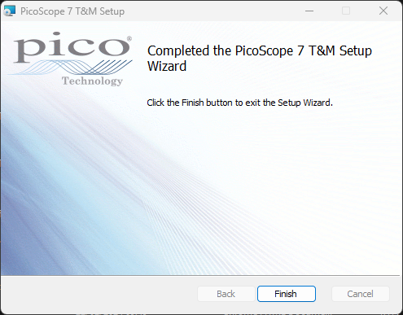

# PicoScope 7 Quick-Start guide
This is a tutorial on how to install, launch and run the PicoScope 7 software for the first time.
It is an ideal tutorial for new users to PicoScope 7 and PicoScopes entirely. 
For more information please contact our tech support team at [support@picotech.com](mailto:support@picotech.com)

## Installing PicoScope 7
### Windows
1. Go to [https://www.picotech.com/downloads](https://www.picotech.com/downloads).
2. Select your **series** and **device** from the lists provided.
3. In **Software** download the **stable** (recommended) version of PicoScope 7.

4. Run the installer and PicoScope 7 will be installed on your PC.

<!-- 
 -->

## Plugging in your PicoScope
1. Use the included USB-A to USB-B cable and plug your PicoScope into your PC.
2. If your device comes with a mains plug adapter, please plug it in for full PicoScope functionality and power on.
3. When successfully plugged in, you may hear an audiable two tones to signify your PC recognising the device.
4. You will see the LED on the front panel of your PicoScope lit with a solid colour.
5. Your PicoScope is now plugged in, now you can Launch PicoScope 7.

## Launching PicoScope 7
1. Find the PicoScope 7 icon on your desktop or start menu, and click to launch PicoScope 7.

2. PicoScope 7 will open and search for a device on start-up.
3. If your PicoScope is detected, and it's the only PicoScope plugged in, it will connect and run that PicoScope.
4. If there is more than 1 PicoScope attached, you will need to select which PicoScope you are using. 
 
5. Once a PicoScope is connected, the software will now be running.

## Adjusting voltage and timebase
null
